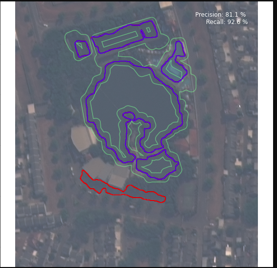
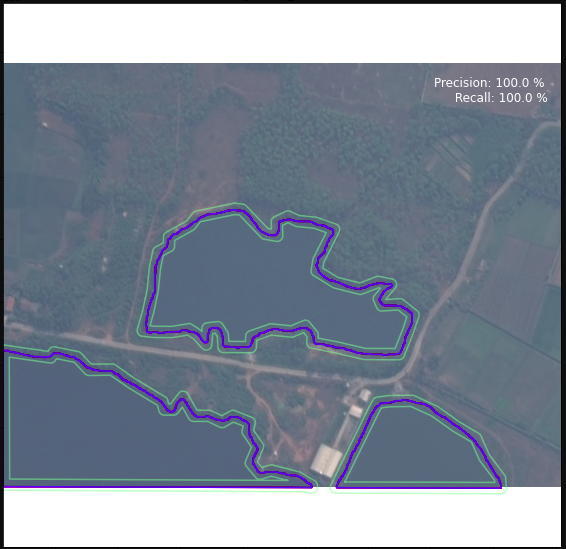

# Rimbuin.io | Water Detection Model

## Introduction
Monitoring urban wilderness at scale.

## Technical Details

### Introduction
In this part, we are focusing on identifying the water bodies over a region. We have used Deep Learning Model with U-Net Architecture.

Water Detection 1                | Water Detection 2
:-------------------------------:|:------------------------------:
 |

### File Structure

water_detection_model/
├── enhanced_image
│   ├── jpg_raster_files
│   ├── model_weights
│   ├── results
│   │   ├── shapefiles_waterbodies
│   │   │   ├── test
│   │   │   ├── train
│   │   │   └── val
│   │   ├── test
│   │   ├── train
│   │   └── val
│   ├── test
│   ├── test_mask
│   ├── train
│   ├── train_mask
│   ├── val
│   └── val_mask
├── logs
├── notebooks
└── source_data
    ├── islands_annotations
    ├── mask_files
    ├── raster_files
    └── water_annotations

### How To Start The Training The Model

We have created the `train.py` script to start the training the model. Go to the directory where it is located.

Below is the command to start the training.

```
python train_model.py \
--batch=16 \
--data_path='/home/ubuntu/sukh_share/water_detection_model/NIR_Green_Blue' \
--train_raster_file_folder_name='train' \
--train_mask_file_folder_name='train_mask' \
--val_raster_file_folder_name='val' \
--val_mask_file_folder_name='val_mask' \
--image_color_mode='rgb' \
--mask_color_mode='rgb' \
--model_weight_path='/home/ubuntu/sukh_share/water_detection_model/NIR_Green_Blue/model_weights' \
--model_version=1 \
--number_of_channel=3 \
--log='/home/ubuntu/sukh_share/water_detection_model/logs'
```

#### Parameter Specfications For The Command

* **batch** : number of images that is to be considered in a batch
* **data_path** : It specifies the root path which contains the training dataset like train,val etc.
* **train_raster_file_folder_name** : Name of the folder which contains the data which will be used for training.
* **train_mask_file_folder_name** : Name of the folder which contains the mask file data corresponding the training data.
* **val_raster_file_folder_name** : Name of the folder which contains the data which will be used for validation.
* **val_mask_file_folder_name** : ame of the folder which contains the mask file data corresponding the validation data.
* **image_color_mode** : It specifies the color mode which will be used to create the Image Data Generator object.  One of "grayscale", "rgb", "rgba". Default: "rgb". Whether the images will be converted to have 1, 3, or 4 channels.
* **mask_color_mode** : It specifies the color mode for mask which will be used to create the Image Data Generator object.  One of "grayscale", "rgb", "rgba". Default: "rgb". Whether the images will be converted to have 1, 3, or 4 channels.
* **model_weight_path** : It specifies where we want to store the weihts during the training.
* **model_version** : It specifies the model version.
* **number_of_channel** : It specifies the number of channgel which will be used to create the input layer for the training model.
* **log** : It specifies the location where the logs gets saved which will be generated while training.

### Notebook Documentation

These are the following notebook which are used in achieving the purpose:

* Converting_Shapefiles_Into_A_Binary_Raster - [Converting Shapefiles Into A Binary Raster](doc/Converting_Shapefiles_Into_A_Binary_Raster_README.md)
* tiff2jpg - [Tiff to Jpg](doc/tiff2jpg_README.md)
* train_model - [train model](doc/train_model_README.md)
* create_inference_for_larger_region - [create inference for larger region README](doc/create_inference_for_larger_region_README.md)