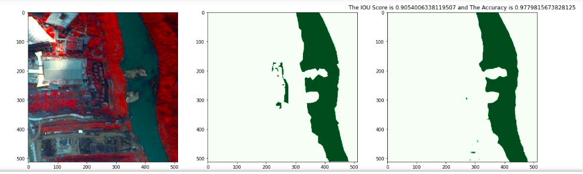
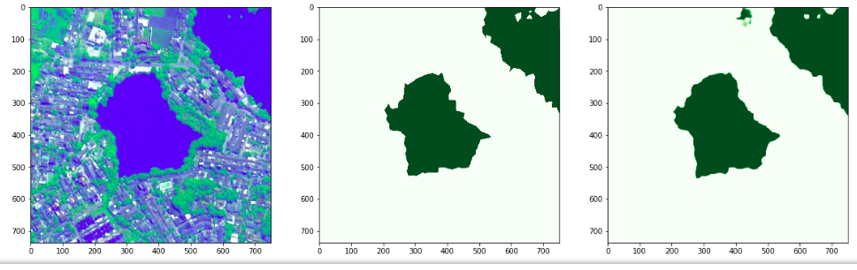

# Train Model Notebook

This notebook will help us in achieving the followings:

* Visualisation Of The Data Before Splitting
* Setting Up The Dataset By Splitting The Data Into Train, Val and Test Set.
* Check And Visualise The Data Present In The Train, Val and Test Directory After Splitting Along With The Mask Files.
* Create The Image Data Generator Object And The Then Visualise The Data From The Object
* Create The Model Using The Segmentation Model Package To Test The Training If It Works.
* After The Completion Of The Training, It Helps In Generating The Inference With Them IOU And Accuracy Metric Score Along With Its Visualisation Against The Original Raster File And The Actual Mask File
  

* Visualise The Saved Inference.
  

## Requirements

This notebook requires the following thing in order to proceed:

* Raster Files must be converted into jpg format. This task can be achieved by using the **tiff2jpg** notebook.
  
* Manuall Annotated ShapeFiles must be rasterise into tif files. This task can be achieved by using the **Converting_Shapefiles_Into_A_Binary_Raster** notebook.
  